# ZOH Implementation Workflow

## Overview

This guide provides a comprehensive, language-agnostic workflow for implementing ZOH, an embedded scripting language built for storytelling. Any human or LLM can follow these workflows to implement ZOH in any programming language.

---

## Language Summary

ZOH is verb-driven: everything is a *verb*. From dialogue (`/converse`) to visuals (`/show`) to logic (`/if`), all operations follow uniform syntax, making scripts easy to reason about.

### Key Characteristics

| Aspect | Description |
|--------|-------------|
| **Paradigm** | Verb-driven, event-based scripting |
| **Typing** | Dynamic with optional type annotations |
| **Concurrency** | First-class contexts with channel synchronization |
| **Scoping** | Story and context variable scopes |
| **Extensibility** | Pluggable verb drivers and handlers |

### Core Concepts

```
┌────────────────────────────────────────────────────────────────┐
│                          RUNTIME                               │
│  ┌──────────────────┐  ┌──────────────────┐                    │
│  │    Context A     │  │    Context B     │  ...               │
│  │  ┌────────────┐  │  │  ┌────────────┐  │                    │
│  │  │   Story    │  │  │  │   Story    │  │                    │
│  │  │ (variables)│  │  │  │ (variables)│  │                    │
│  │  └────────────┘  │  │  └────────────┘  │                    │
│  │ (ctx variables)  │  │ (ctx variables)  │                    │
│  └────────────────┬─┘  └─┬────────────────┘                    │
│                   │      │                                     │
│                   ▼ Channels (global, concurrent-safe) ▼       │
│  ┌─────────────────────────────────────────────────────────┐   │
│  │  <channel_a>  │  <channel_b>  │  <channel_c>  │ ...     │   │
│  └─────────────────────────────────────────────────────────┘   │
│                                                                │
│  ┌─────────────────────────────────────────────────────────┐   │
│  │                Persistent Storage                        │   │
│  └─────────────────────────────────────────────────────────┘   │
└────────────────────────────────────────────────────────────────┘
```

---

## Implementation Phases

The implementation is divided into **phases** that build upon each other. Each phase has corresponding detailed workflow documents.

### Phase 1: Lexical Analysis & Parsing (Foundation)

| Document | Description | Dependencies |
|----------|-------------|--------------|
| [01_lexer.md](./01_lexer.md) | Tokenize ZOH source into a stream of tokens | None |
| [02_parser.md](./02_parser.md) | Build AST from token stream | Lexer |
| [03_preprocessor.md](./03_preprocessor.md) | Handle `#embed`, `#macro`, `#expand`, `#flag` | Parser |

### Phase 2: Core Execution (Engine)

| Document | Description | Dependencies |
|----------|-------------|--------------|
| [04_expressions.md](./04_expressions.md) | Expression grammar and evaluation | Lexer, Parser |
| [05_type_system.md](./05_type_system.md) | Variable types, references, collections | None |
| [06_core_verbs.md](./06_core_verbs.md) | Core verb driver implementations | Type System, Expressions |

### Phase 3: Control Flow & Concurrency

| Document | Description | Dependencies |
|----------|-------------|--------------|
| [07_control_flow.md](./07_control_flow.md) | If, loop, while, foreach, switch, sequence | Core Verbs |
| [08_concurrency.md](./08_concurrency.md) | Contexts, jump, fork, call, channels | Core Verbs, Control Flow |

### Phase 4: Runtime Architecture

| Document | Description | Dependencies |
|----------|-------------|--------------|
| [09_runtime.md](./09_runtime.md) | Runtime, context, handler architecture | All above |
| [10_std_verbs.md](./10_std_verbs.md) | Standard verb implementations | Runtime |
| [11_storage.md](./11_storage.md) | Persistent storage (read/write/erase) | Runtime |
| [12_validation.md](./12_validation.md) | Compilation, validation, diagnostics | All above |
| [13_testing.md](./13_testing.md) | Integration test scenarios | All above |

---

## Dependency Graph

```mermaid
graph TD
    subgraph "Phase 1: Foundation"
        A[01_lexer] --> B[02_parser]
        B --> C[03_preprocessor]
    end
    
    subgraph "Phase 2: Core"
        A --> D[04_expressions]
        B --> D
        E[05_type_system]
        D --> F[06_core_verbs]
        E --> F
    end
    
    subgraph "Phase 3: Flow"
        F --> G[07_control_flow]
        F --> H[08_concurrency]
        G --> H
    end
    
    subgraph "Phase 4: Runtime"
        H --> I[09_runtime]
        I --> J[10_std_verbs]
        I --> K[11_storage]
        I --> L[12_validation]
        C --> I
    end
```



---

## Quick Reference

### Verb Call Syntax

```
/verb [attr1:value] [attr2] param1, param2...; -> *result;
```

- Verbs start with `/`
- Attributes in `[brackets]` (optional, reusable)
- Parameters comma-separated
- Terminated with `;`
- Return via `-> *var;` sugar or `/capture`

### Block Form

```
/verb/
    [attr1] [attr2]
    param1
    param2
/;
```

### Variable Reference

```
*variable           :: Reference to variable
*list[0]            :: Index into list
*map["key"]         :: Key in map
<channel>           :: Channel reference
```

### Expressions

```
`*a + *b`           :: Arithmetic
`*x > 0 && *y < 10` :: Logical
$`*a + 1`           :: Evaluate (sugar for /evaluate)
$"Hello, ${*name}!" :: Interpolate (sugar for /interpolate)
```

### Labels & Navigation

```
@label_name         :: Label definition
====> @label;       :: Jump to label
====+ @label;       :: Fork new context
<===+ @label;       :: Call (blocking fork)
```

---

## File Organization

```
impl/
├── 00_overview.md        # This file
├── 01_lexer.md           # Tokenization
├── 02_parser.md          # AST construction
├── 03_preprocessor.md    # Embed/Macro expansion
├── 04_expressions.md     # Expression evaluation
├── 05_type_system.md     # Types and references
├── 06_core_verbs.md      # Core verb drivers
├── 07_control_flow.md    # Control flow verbs
├── 08_concurrency.md     # Contexts and channels
├── 09_runtime.md         # Runtime architecture
├── 10_std_verbs.md       # Standard verbs
├── 11_storage.md         # Persistent storage
└── 12_validation.md      # Validation pipeline
```

---

## Implementation Checklist

Use this checklist to track your implementation progress:

- [ ] **Phase 1**: Lexer, Parser, Preprocessor
- [ ] **Phase 2**: Expressions, Type System, Core Verbs
- [ ] **Phase 3**: Control Flow, Concurrency
- [ ] **Phase 4**: Runtime, Standard Verbs, Storage, Validation

Each sub-project document contains its own detailed implementation checklist.
